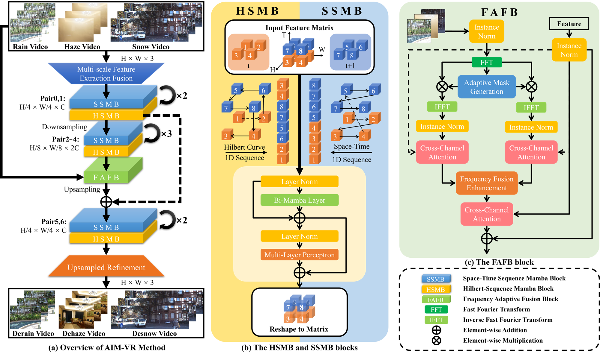

# AIM-VR: All-in-One Video Restoration via Dual-Path Mamba with Frequency Adaptive Fusion

> Official PyTorch implementation of **AIM-VR**, published at **IEEE ICME 2025**.
>
> [Paper (IEEE Xplore)](https://doi.org/10.1109/ICME59968.2025.11209023)

**AIM-VR: All-in-One Video Restoration via Dual-Path Mamba with Frequency Adaptive Fusion**
<br>
Zhizhou Lu, Tianrui Liu\*, Junjie Huang, Zihan Chen, Xueqiong Li\*, Baili Xiao, Wentao Zhao\*
<br>
College of Computer Science and Technology, National University of Defense Technology, Changsha, China
<br>
(\* corresponding authors)

---

## 📖 Introduction

Real-world video-based vision systems frequently suffer concurrent degradations caused by unpredictable weather conditions such as rain, haze, and snow. AIM-VR is a multi-degradation video restoration framework built on the Selective State Space Model (Mamba), with three key designs:

1. **Dual-Path Mamba Modeling (DPMM)** — complementary Space-Time Sequence Mamba Block (**SSMB**) and Hilbert-Sequence Mamba Block (**HSMB**) for efficient spatiotemporal modeling with linear-complexity scanning;
2. **Frequency Adaptive Fusion Block (FAFB)** — degradation-specific feature modulation via learnable frequency decomposition and gating;
3. **Universal Multi-degradation Contrastive Learning (UMCL)** — a contrastive objective for robust degradation pattern discovery (the paper's Sec. 3.3; contrastive loss implementations are provided in `mmagic/models/losses/`).

<p align="center">

</p>

This work is extended by our journal paper **FLAME** (IEEE TIP), whose code is available at [StephenLockhart/FLAME](https://github.com/StephenLockhart/FLAME).

## 📊 Results (W3 all-in-one multi-weather benchmark)

| Test subset | PSNR (dB) | SSIM |
|---|---|---|
| Rain (RainMotion) | 32.98 | 0.9580 |
| Snow (KITTI) | 34.26 | 0.9729 |
| Haze (REVIDE) | 24.11 | 0.9285 |
| **Average** | **30.45** | **0.9531** |

A single model trained on the mixed W3 training set handles all three weather types, outperforming prior state-of-the-art video restoration methods by 0.82 dB PSNR on average.

## 🛠️ Installation

Tested with Python 3.10+, PyTorch 2.x (CUDA 12.x), MMCV 2.x, MMEngine 0.10.5.

```bash
# 1. Create environment
conda create -n aimvr python=3.10 -y
conda activate aimvr

# 2. Install PyTorch (adjust CUDA version to your driver)
pip install torch==2.7.0 torchvision --index-url https://download.pytorch.org/whl/cu128

# 3. Install OpenMMLab runtime
pip install -U openmim
mim install "mmcv>=2.0.0" "mmengine==0.10.5"

# 4. Install minimal dependencies
pip install einops opencv-python Pillow numpy requests tensorboard matplotlib lpips
# Selective-scan CUDA kernels used by the Mamba blocks:
pip install causal-conv1d
pip install mamba-ssm

# 5. Install this repository
git clone https://github.com/StephenLockhart/AIM-VR.git
cd AIM-VR
pip install -e .
```

> The complete upstream dependency list is in `requirements/runtime.txt`; the packages above are sufficient for AIM-VR training and testing.

## 🚀 Quick Start

### 1. Pretrained weights

The AIM-VR checkpoint (W3, reproducing the 30.45 dB average in Table I) will be
released through HuggingFace / Baidu Netdisk — link coming soon.

### 2. Prepare the W3 dataset

W3 is an all-in-one multi-weather mixture built from three public sources:

- **Rain** — RainMotion rain sequences
- **Snow** — KITTI-based snow sequences
- **Haze** — REVIDE indoor hazy videos

Organize them as expected by the configs (`data/ALL50/Train_W3`, and
`Test_W3` / `Result_W3` splits with `RainMotion`, `KITTI_snow`,
`REVIDE_indoor` sub-folders). Set `data_root` inside the config files to your
local copy; the exact folder keys and frame naming are visible in
`configs/aimvr/a2laim-nc_f256_lr1e-4_W3.py`.

### 3. Testing

```bash
python tools/test.py \
    configs/aimvr/test/a2laim-nc_f256_lr1e-4_W3_Test.py \
    checkpoints/aimvr_w3.pth
```

### 4. Training

```bash
python tools/train.py configs/aimvr/a2laim-nc_f256_lr1e-4_W3.py
```

The released config corresponds to the reported W3 model: `AimVR` wrapper with
`A2LAimNet` generator (256 channels, 5 input frames, 256×256 patches,
Charbonnier + VGG16 perceptual loss, AdamW 1e-4, 300K iterations).

## 🗂️ Code Structure

AIM-VR is implemented on top of the [MMagic](https://github.com/open-mmlab/mmagic) framework.

```
mmagic/models/editors/aimvsr/
├── aimvr.py              # AimVR wrapper (training/inference pipeline)
├── aimvr_net.py          # DPMM backbone + FAFB frequency modules (AimVRNet)
├── a2laim_net.py         # A2LAimNet generator used by the reported W3 model
├── aim_net.py            # Ablation variant without frequency fusion
├── aimvsr.py             # AimVSR super-resolution wrapper
└── modules/
    ├── mambablock.py     # Space-Time Sequence Mamba block (SSMB)
    ├── Hymamba.py        # Hilbert-Sequence Mamba block (HSMB)
    ├── Hilbert3d.py      # 3D Hilbert/Gilbert scanning curve
    ├── convnext.py       # ConvNeXt feature encoder
    ├── FGDFA.py          # Frequency-guided components
    └── head.py           # Projection head
configs/aimvr/            # W3 training and testing configs
```

## 🎓 Citation

If you find this work useful, please cite:

```bibtex
@inproceedings{aimvr,
  author    = {Lu, Zhizhou and Liu, Tianrui and Huang, Junjie and Chen, Zihan and
               Li, Xueqiong and Xiao, Baili and Zhao, Wentao},
  title     = {{AIM-VR}: All-in-One Video Restoration via Dual-Path Mamba with
               Frequency Adaptive Fusion},
  booktitle = {2025 IEEE International Conference on Multimedia and Expo (ICME)},
  year      = {2025},
  pages     = {1--6},
  doi       = {10.1109/ICME59968.2025.11209023}
}
```

## 🙏 Acknowledgement

This project is built upon [MMagic](https://github.com/open-mmlab/mmagic). The Hilbert scanning follows [gilbert](https://github.com/jakubcerveny/gilbert), the Mamba blocks are built on [mamba_ssm](https://github.com/state-spaces/mamba) and [timm](https://github.com/huggingface/pytorch-image-models), and the ConvNeXt encoder follows [mmclassification](https://github.com/open-mmlab/mmclassification). We thank all the authors for their excellent open-source work. See [THIRD_PARTY_NOTICES.md](THIRD_PARTY_NOTICES.md) for the full provenance list.

## 📄 License

This project is released under the [Apache License 2.0](LICENSE).
